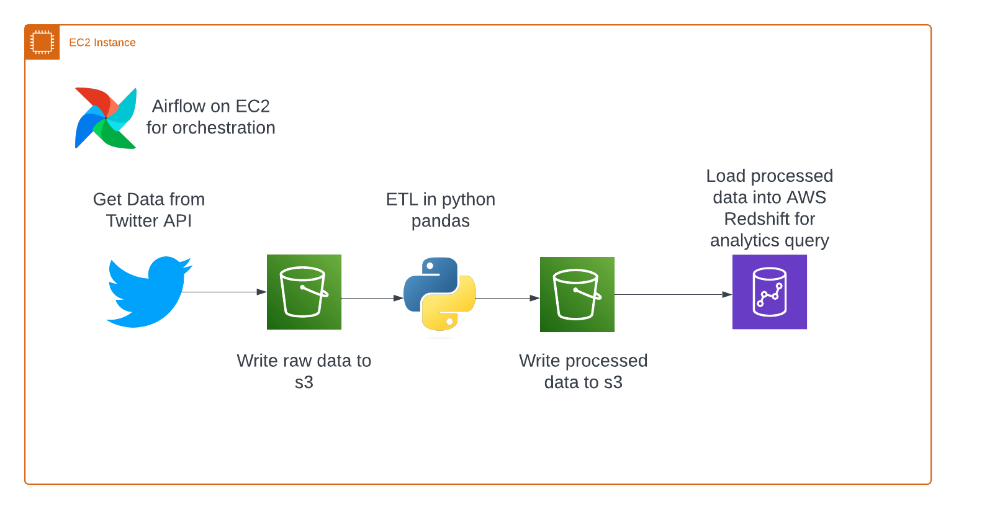

# Twitter Data Processing and Analysis Project

## Project Overview

This project aims to collect, process, and analyze Elon Mush Tweet Twitter data for insights into top topics discussed about or trends. It uses Python for data collection and transformation, Amazon S3 for data storage, Amazon Redshift for data warehousing, and Apache Airflow for orchestrating the data pipeline. The data pipeline is deployed on EC2 instance.

## Architecture


## Prerequisites
- Python 3.x
- Access to Twitter API (You'll need to create a Twitter Developer account and create an app to get API keys)
- AWS account (for EC2, S3 and Redshift)
- Apache Airflow set up on EC2 instance

## Installing Dependencies

```pip install -r requirements.txt```

## Configuring AWS Resources
- Create IAM role such that you can access s3 and redshift from your EC2 instance
- S3 Bucket: Create an S3 bucket for storing raw and processed data.
- Redshift Cluster: Set up a Redshift cluster. Ensure it can access the S3 bucket.
- Airflow Configuration
    - Set up Airflow connections for AWS and Redshift.
    - Place the DAG file in your Airflow DAGs folder.

## Usage
Schedule the pipeline using Airflow.

### Collecting Twitter Data
**Script: scripts/data_collection.py**
- Functionality: Collects tweets based on specified criteria and stores them in S3.
Data Transformation

**Script: scripts/data_transformation.py**
- Functionality: Transforms the raw Twitter data using Pandas and uploads the processed data to S3.

### Loading Data into Redshift
- Script: scripts/data_load_to_redshift.py
- Functionality: Loads processed data from S3 into Redshift for analysis.

### Airflow DAG
- DAG ID: twitter_dag_elonmusk_tweets
- Schedule: Daily (can be adjusted as needed)
- Tasks: Collect data, transform data, load to Redshift, create Redshift tables.

## Analysis Result
Identified the top Elon Musk tweet topics between 2023-11-23 and 2024-02-24 to be related to Space X and Tesla. More details in -`redshift_queries.sql`